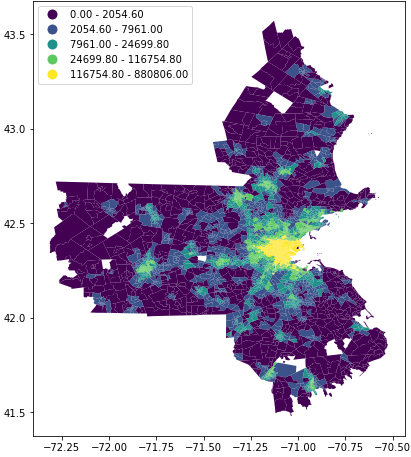

## tracc | Transport accessibility measures in Python

This library combines land-use data (e.g. location of jobs, population, shops, healthcare, etc.) and pre-computed travel costs (e.g. travel times, transit fares, etc.) to generate transport accessibility metrics. Most of the work is conducted by manipulating [pandas](https://github.com/pandas-dev/pandas) DataFrames. Current functionality allows for computing three types of accessibility measures. These include:

1. Potential accessibility measures: the sum of opportunities reachable from a location, weighted by their proximity (e.g. access to employment in a region, like how many jobs can be reached in a 45 minute commute)

2. Passive accessibility measures: the sum of the population who can access a location, weighted by their proximity (e.g. access to the labour force in a region, like how many workers can commute to a location within 30 minutes)

3. Minimum travel cost measures: the minimum travel cost to reach X opportunities (e.g. what is travel time to the nearest grocery store, or the minimum travel time to the nearest 3 libraries)

The library also includes functions for

- estimating intra-zonal travel costs

- filling in gaps in a travel cost matrix using a spatial weights matrices

- generating travel impedance based on different functions (cumulative, linear, negative exponential, inverse power)

- computing generalized costs

Planned future functionality will include competitive (i.e. floating catchment) measures of accessibility. Also on the to do list is to create proper documentation. For now, take a look at the basic usage and examples linked below.

## Installation

```
pip install tracc
```

Requirements are [pandas](https://github.com/pandas-dev/pandas), [numpy](https://github.com/numpy/numpy), [geopandas](https://github.com/geopandas/geopandas), [libpysal](https://github.com/pysal/libpysal)

## Basic Usage

```Python
# Loading in destination data.
# For this example, these are job counts by block group from the the LEHD for Boston.
dfo = tracc.supply(
    supply_df =pd.read_csv("examples/test_data/boston/destination_employment_lehd.csv")
    columns = ["block_group_id","C000"] # C000 pertains to the total number of jobs
    )


# Loading in travel costs.
# For this example, travel times by transit between block groups in Boston at 8am on June 30, 2020.
dft = tracc.costs(
    pd.read_csv(
    "examples/test_data/boston/transit_time_matrix_8am_30_06_2020.zip",
    compression='zip')
    )
dft.data.time = dft.data.time / 60 # converting time from seconds to minutes


# Computing impedance function based on a 45 minute travel time threshold.
dft.impedence_calc(
    cost_column = "time",
    impedence_func = "cumulative",
    impedence_func_params = 45,
    output_col_name = "fCij_c45",
    prune_output = False
)


# Setting up the accessibility object.
# This includes joining the destination data to the travel time data.
acc = tracc.accessibility(
    travelcosts_df = dft.data,
    supply_df = dfo.data,
    travelcosts_ids = ["o_block","d_block"],
    supply_ids = "block_group_id"
    )


# Computing accessibility to jobs based on the 45-min threshold.
dfa = acc.potential(
    opportunity = "C000",
    impedence = "fCij_c45"
    )
```

Here's the top five rows of `dfa` (e.g. from block group `250056001001` someone can reach 4,061 jobs in a 45 minute transit trip)

```
    o_block       A_C000_fCij_c45
---------------------------------
0 	250056001001 	4061.0
1 	250056001002 	3960.0
2 	250056002021 	3608.0
3 	250056002022 	7845.0
4 	250056002023 	5124.0
```

This result can then be mapped in Python, QGIS, or any other mapping software by joining to the spatial data that pertain to these locations. Here's a quick example:

```Python
bg = gpd.read_file("example/test_data/boston/block_group_poly.geojson")
bg = bg.merge(dfa, left_on='GEOID', right_on = "o_block", how = "left")
bg.plot(column='A_C000_fCij_c45', figsize=(8, 8), scheme='quantiles', legend=True);
```



## Examples

- [Basic usage example](examples/basic_accessibility_example.ipynb)

- [Intrazonal travel times and spatial smoothing](examples/intrazonal_times_and_spatial_smoothing.ipynb)
